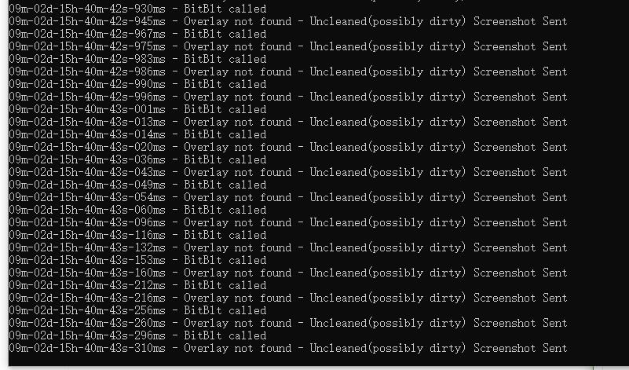

### BitBlt Hook

#### Universal BitBlt Screenshot Cleaner Project

https://guidedhacking.com/threads/screenshot-cleaner-bypass-fairfight-punkbuster-bitblt-hook.15216/

```
VS2017 TEST

x86 / x64 Compatible  兼容x86和x64

It will save it to ~\Desktop\screenshots\

图片保存到保存在桌面的screenshots文件夹
```


##### HotKey 快捷键

```
HOME: Open/Close 开/关BitBlt截图

Num9：Screenshot  截取用户桌面

END: eject DLL  卸载DLL注入
```

##### How to take a screenshot with BitBlt and save to a file  BitBlt接口截图

```c++
#include <iostream>
#include <ctime>
#include <chrono>
#include <iomanip>
#include <windows.h>
#include <ShlObj.h>

#pragma warning(once : 4996)

const wchar_t* gameWindowTitle = L"Star Wars Battlefront II";

std::wstring GetFileName()
{
    wchar_t* path = new wchar_t[MAX_PATH];
    SHGetKnownFolderPath(FOLDERID_Desktop, 0, 0, &path);

    if (GetLastError() == 1008)
        SetLastError(0);

    std::wstring wpath(std::wstring(path) + L"\\screenshots\\");
    CreateDirectory(wpath.c_str(), NULL);

    std::chrono::system_clock::time_point now = std::chrono::system_clock::now();
    std::time_t now_c = std::chrono::system_clock::to_time_t(now);
    std::tm now_tm = *std::localtime(&now_c);

    wchar_t timetext[40];
    wcsftime(timetext, sizeof(timetext), L"%m%d%H%M%S", &now_tm);

    return wpath + timetext + L".bmp";
}

class BMP_T
{
public:
    BITMAPFILEHEADER   bmfHeader{ 0 };
    BITMAPINFOHEADER   bi{ 0 };
    BYTE* bmp{ nullptr };
    DWORD dwBmpSize;

    BMP_T() {}

    BMP_T(int width, int height)
    {
        bi.biSize = sizeof(BITMAPINFOHEADER);
        bi.biWidth = width;
        bi.biHeight = height;
        bi.biPlanes = 1;
        bi.biBitCount = 32;
        bi.biCompression = BI_RGB;
        bi.biSizeImage = 0;
        bi.biXPelsPerMeter = 0;
        bi.biYPelsPerMeter = 0;
        bi.biClrUsed = 0;
        bi.biClrImportant = 0;

        dwBmpSize = ((width * bi.biBitCount + 31) / 32) * 4 * height;

        // Add the size of the headers to the size of the bitmap to get the total file size
        bmfHeader.bfSize = dwBmpSize + sizeof(BITMAPFILEHEADER) + sizeof(BITMAPINFOHEADER);

        //Offset to where the actual bitmap bits start.
        bmfHeader.bfOffBits = (DWORD)sizeof(BITMAPFILEHEADER) + (DWORD)sizeof(BITMAPINFOHEADER);

        //bfType must always be BM for Bitmaps
        bmfHeader.bfType = 0x4D42; //BM

        bmp = new BYTE[dwBmpSize];
    }

    ~BMP_T()
    {
        delete[] bmp;
    }
};

void SaveNewScreenshot(HWND hWnd)
{
    // === Begin Setup & Calling of BitBlt() ===

    //HWND hwnd = GetDesktopWindow();
    HDC hdcSrc = GetWindowDC(hWnd);

    RECT rect;
    GetClientRect(hWnd, &rect);

    HDC hdcDst = CreateCompatibleDC(hdcSrc);
    HBITMAP hbitmap = CreateCompatibleBitmap(hdcSrc, rect.right, rect.bottom);

    SelectObject(hdcDst, hbitmap);

    BOOL bResult = BitBlt(hdcDst, 0, 0, rect.right, rect.bottom, hdcSrc, 0, 0, SRCCOPY);//probs

    // === End Setup & Calling of BitBlt() ===

    // === Setup Bitmap Structure ===

    // Get the BITMAP from the HBITMAP
    BITMAP bmpScreen;
    GetObject(hbitmap, sizeof(BITMAP), &bmpScreen);

    BMP_T bmp_t(rect.right, rect.bottom);

    // === End Setup of Bitmap Structure ===

    // Gets the "bits" from the bitmap and copies them into a buffer
    //GetDIBits(hdcSrc, hbitmap, 0, (UINT)bmpScreen.bmHeight, bmp_t.bmp, (BITMAPINFO*)&bmp_t.bi, DIB_RGB_COLORS);
    GetDIBits(hdcSrc, hbitmap, 0, (UINT)rect.bottom, bmp_t.bmp, (BITMAPINFO*)&bmp_t.bi, DIB_RGB_COLORS);

    // === Begin Saving File to Disk ===

    std::wstring path = GetFileName();
    path.insert(path.find(L".bmp"), std::wstring(L"_reg"));

    HANDLE hFile = CreateFile(path.c_str(), GENERIC_WRITE, 0, NULL, CREATE_ALWAYS, FILE_ATTRIBUTE_NORMAL, NULL);

    DWORD dwBytesWritten = 0;
    WriteFile(hFile, (void*)&bmp_t.bmfHeader, sizeof(BITMAPFILEHEADER), &dwBytesWritten, NULL);
    WriteFile(hFile, (void*)&bmp_t.bi, sizeof(BITMAPINFOHEADER), &dwBytesWritten, NULL);
    WriteFile(hFile, (void*)bmp_t.bmp, bmp_t.dwBmpSize, &dwBytesWritten, NULL);

    CloseHandle(hFile);

    DeleteObject(hbitmap);
    DeleteObject(hdcDst);
    ReleaseDC(NULL, hdcSrc);
}
```

##### 用途

禁用BitBlt截图反作弊

##### Test 测试截图




